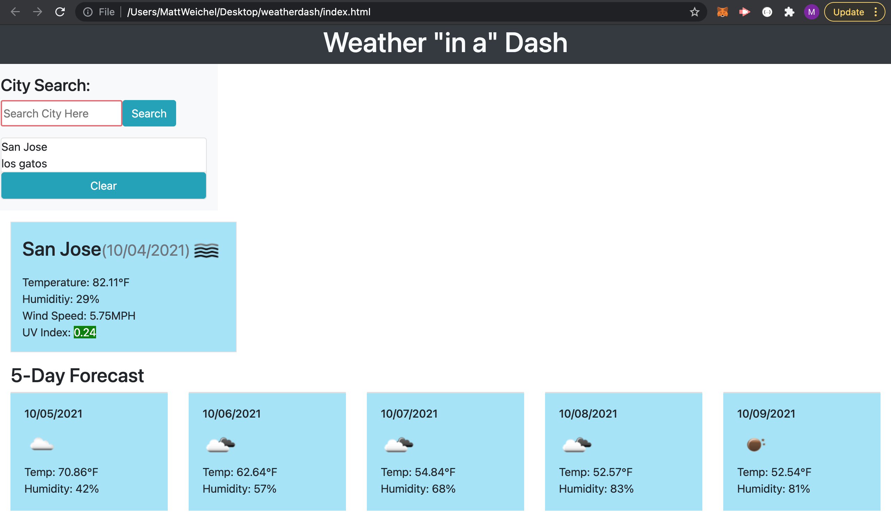

# Weather Dashboard

The goal of this project is to provide a simple dashboard where the user can input a city name and see the current weather condition for that location, as well as a brief five day forecast.  Once a city is searched it is saved into a list where it can be clicked to quickly change the displayed location to the city clicked. The weather information is sourced using Open Weather Map's API and integrated into the website utilizing jQuery.

## Built With

* [HTML](https://developer.mozilla.org/en-US/docs/Web/HTML)
* [CSS](https://developer.mozilla.org/en-US/docs/Web/CSS)
* [Javascript](https://developer.mozilla.org/en-US/docs/Web/JavaScript)

## Deployed Link

* [See Live Site](https://maweiche.github.io/weatherdash/)

## Screenshot

## Authors

* **Matthew Weichel** 

- [Link to Github](https://github.com/maweiche)

## License

This project is licensed under the MIT License 

## Acknowledgments

* Hat tip to anyone whose code, libraries, packages, or UI was used  / inspired from

